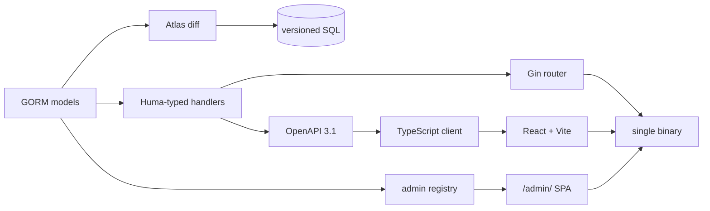

# Gombit

[](https://github.com/gombit-dev/gombit/actions/workflows/ci.yml)
[](https://github.com/gombit-dev/gombit/actions/workflows/release.yml)
[](https://go.dev/dl/)
[](LICENSE)
[](https://pkg.go.dev/github.com/gombit-dev/gombit)

**A Django-for-Go full-stack framework.** One CLI scaffolds a typed Go API, its
OpenAPI document, a matching TypeScript client, a React frontend, versioned SQL
migrations, session auth, and a working admin — then builds the whole thing into
a single binary.

```bash
go install github.com/gombit-dev/gombit/cmd/gombit@latest
gombit new tasks --database sqlite --auth cookie --ui mui
cd tasks && gombit dev
```

> **Status: pre-1.0 (v0.6).** The CRUD loop, the admin, and schema-safety
> tooling are shipped and CI-gated across SQLite, PostgreSQL, and MySQL;
> background jobs are shipped and CI-gated against Redis; and a fault-injection
> suite runs on every PR. APIs may still change
> between minor versions — pin an exact version and read the
> [changelog](CHANGELOG.md) before upgrading.

## Why Gombit

Go has excellent HTTP routers. What it doesn't have is the thing Django users
miss on day one: the **batteries**, wired together and agreeing with each other.

Gombit's position is that the pieces you'd otherwise assemble by hand — schema,
API contract, typed client, auth, admin — should be **derived from one source of
truth** instead of hand-synchronized:

- **Your handler signature is the contract.** OpenAPI 3.1 is emitted from
  Huma-typed handlers, never hand-written, and the TypeScript client is
  generated from that. A drift check fails CI when they disagree.
- **Your GORM model is the schema — and the resource.** Migrations are
  versioned SQL diffed by Atlas from your models — readable, reviewable, and
  reversible, with destructive changes refused until you acknowledge them. The
  request/response DTOs and CRUD handlers are regenerated from the same model.
  Versioned SQL is the migration path and there is no hand-rolled migration
  DSL. (The scaffolded server also runs `platform.AutoMigrate` on start, so a
  new app can serve before its first `gombit db migrate`; see
  [migrations.md](docs/migrations.md).)
- **Your registry is the admin.** A real Django-style admin at `/admin/`,
  served by the framework at runtime, not generated pages you inherit and
  maintain.

And the escape hatches are real: `app.Router()` hands you the raw `*gin.Engine`,
tested and first-class.

## What's in the box

| | |
| --- | --- |
| **Runtime** | Gin + [Huma](https://huma.rocks/) with typed handlers, `framework.App` lifecycle hooks, graceful shutdown, structured logging, typed env config with secret redaction, memory/Redis cache, `/livez` + `/readyz` probes, Prometheus `/metrics` |
| **Data** | GORM over **SQLite, PostgreSQL, and MySQL** — all three CI-gated on every push, with a shared conformance suite; deletes are physical, so your `ON DELETE` rules decide what happens |
| **Resources** | `make resource` scaffolds a model you own; `gombit generate` derives the DTOs and CRUD handlers (`*.gen.go`) from it, with hooks for customization and `--check` to catch drift |
| **Migrations** | [Atlas](https://atlasgo.io/)-backed `gombit db makemigrations / migrate / rollback / status / seed / reset`, plus `plan`, `lint`, and `check`, which classify every change and refuse destructive or unsafe ones until acknowledged |
| **Contract** | OpenAPI 3.1 emitted from code, interactive `/docs`, generated TypeScript client, contract drift check |
| **Jobs** | Typed background jobs over sync, in-memory, or Redis queues; a worker with retries, backoff, timeouts, delayed and unique jobs; failed-job tooling (`gombit jobs`); job metrics and OpenTelemetry spans |
| **Storage** | `app.Storage()` over local files, memory, or S3-compatible stores; streaming uploads with size and content-type policies; public and signed URLs; direct browser uploads; claim-based cleanup that never deletes a file a record holds; `file` / `image` model fields with generated upload operations and admin widgets |
| **Frontend** | Vite + React + TypeScript, React Hook Form, optional Material UI CRUD preset (`--ui mui`) |
| **Auth** | Bearer JWT with refresh rotation (token in memory, **never `localStorage`**), or first-class cookie sessions with CSRF (`--auth cookie`) |
| **Admin** | Runtime generic admin at `/admin/` with introspection API, permissions, groups, superuser bypass, and file and image fields (direct uploads, previews) |
| **CLI** | Cobra tree: `new`, `dev`, `worker`, `jobs`, `build --embed`, `make resource`, `make command`, `generate`, `db`, `openapi`, `client`, `contract`, `routes`, `doctor`, `config`, `createsuperuser`, `version` |
| **Deploy** | `gombit build --embed` — API, SPA, and admin in one binary; a machine-readable app contract (`gombit contract app`) and migration safety manifests for deployment hosts |

## Quick start

**Prerequisites:** Go 1.26+, Node 22+, and a C toolchain (SQLite is cgo-only).
`make resource` and most `gombit db` commands also need
[Atlas](https://atlasgo.io/):
`curl -sSf https://atlasgo.sh | sh -s -- --community`. Full details in
[installation.md](docs/installation.md).

```bash
# 1. Install
go install github.com/gombit-dev/gombit/cmd/gombit@latest

# 2. Scaffold
gombit new tasks --database sqlite --auth cookie --ui mui
cd tasks

# 3. Run the API and frontend together
gombit dev
```

`gombit dev` serves the Go API and Vite together, proxies `/api` and
`/openapi.json`, and regenerates the TypeScript client whenever the spec
changes:

| URL | |
| --- | --- |
| <http://127.0.0.1:5173> | React app |
| <http://127.0.0.1:8080/docs> | interactive API docs |
| <http://127.0.0.1:8080/admin/> | admin SPA |

### The CRUD loop

```bash
# Generate a feature package: the model (yours), generated DTOs and handlers,
# React pages, and the versioned SQL migration for the new table.
gombit make resource Task title:string:required done:bool

# Read the migration it wrote, then apply it.
gombit db migrate

# Regenerate the typed client (gombit dev also does this when the spec changes).
gombit client generate

# Create an admin account and open /admin/.
gombit createsuperuser --email admin@example.com
```

`make resource` is model-first: `internal/task/task.go` and `hooks.go` are
yours, while `dto.gen.go` and `handler.gen.go` are regenerated from the model
by `gombit generate` — change the model, re-run it, and
`gombit generate --check` exits non-zero when a committed copy is stale.
Routes are registered in `cmd/server/main.go` and the model is added to the
`AutoMigrate` list in `internal/platform/database.go`, both through `go/ast`,
never regex. Generators are idempotent and additive, support `--dry-run` and
`--force`, and never overwrite files you own. `createsuperuser` needs no setup:
`gombit new` already wrote a random `GOMBIT_JWT_SECRET` into `.env`, and every
command that reads the app's configuration — `createsuperuser` among them, and
the server itself — applies the project's `.env`, with the process environment
taking precedence.

Before you ship a schema change, `gombit db check` validates the whole chain —
models, generated contract, migrations, and the live database — in one command.

Then ship it:

```bash
gombit build --embed   # one binary: API + SPA + admin
```

**Next:** the [tutorial](docs/tutorial.md) walks this whole loop with
explanations, and [`examples/tutorial/`](examples/tutorial) is the finished app.

## Architecture



Both arrows out of your model are the point: one declaration drives the schema
and the API, and one API drives the client.

The response envelope is fixed so clients can rely on it — success is
`{"data": ..., "meta"?: ...}`, and errors carry a machine-readable code plus
per-field detail:

```json
{
  "error": {
    "code": "validation_error",
    "message": "The request contains invalid fields.",
    "fields": {"title": ["expected length >= 1"]},
    "request_id": "5db935cd-7c74-4ffe-a4de-0fa817451f54"
  }
}
```

## The admin

Gin, Echo, Fiber, and Encore don't ship a Django-style admin; in Go it is
usually a separate library you wire up yourself. Gombit's is built in — a
**runtime** surface over an explicit registry:

```go
admin.Register(app, Task{}, admin.Options{
	Slug:   "tasks",
	List:   []string{"title", "done"},
	Search: []string{"title"},
})
```

That gives you list, detail, create, update, and delete at `/admin/`, backed by
`GET /api/v1/admin/meta` and a generic `/api/v1/admin/resources/{slug}` data
plane. Permissions default to `admin.{slug}.{action}`, are granted directly or
through groups, and superusers bypass them.

Registration is explicit and typed — resolved once at startup, with no
request-time reflection over your models, and no generated admin pages for you
to maintain. Requires cookie auth. See [admin.md](docs/admin.md) and
[ADR-013](docs/adr/013-runtime-generic-admin.md).

## Compared with

| | Gombit | Gin / Echo / Fiber | Buffalo | Encore |
| --- | --- | --- | --- | --- |
| HTTP routing | ✅ (Gin) | ✅ | ✅ | ✅ |
| Typed OpenAPI from code | ✅ | ➖ add-on | ➖ | ✅ |
| Generated TS client + drift check | ✅ | ➖ | ➖ | ✅ |
| Versioned SQL migrations | ✅ (Atlas) | ➖ | ✅ (fizz) | ✅ |
| Scaffolding generators | ✅ AST-safe | ➖ | ✅ | ➖ |
| Session auth + CSRF | ✅ | ➖ | ✅ | ➖ |
| Background jobs + worker | ✅ | ➖ | ✅ | ✅ (Pub/Sub) |
| **Django-style admin** | ✅ | ➖ | ➖ | ➖ |

Gombit is younger than all of them. If you want a minimal router, use Gin
directly — Gombit *is* Gin underneath, and hands it back to you on request.

## Performance

The [`benchmarks/`](benchmarks/) suite measures the same canonical
`/api/projects` CRUD app across six stacks (Gin+GORM, Gombit, Django, Rails,
Laravel, NestJS) under fixed resource limits, plus each container's operational
footprint. The block below is generated by `make benchmark-report` from
`benchmarks/results/latest/` — do not edit it by hand; a CI job
(`benchmark-report-drift`) fails if it no longer matches the generator. **Read
[the methodology](benchmarks/docs/methodology.md), especially
"How not to interpret these results", before citing any figure:** these are
closed-loop numbers, produced by three separate runs — each table states the
commit, host and toolchain it was measured at, and figures are not comparable
across tables. It is not a cross-language leaderboard.

<!-- benchmark-results:start -->
> ### Not measured on dedicated hardware
>
> These tables were not all measured on a host declared as **dedicated benchmark hardware** (recorded host class: `undeclared`), so they are a development sample, not the published benchmark — whatever protocol they ran. Re-run the affected group(s) on a quiet, dedicated host with `BENCHMARK_HOST_CLASS=dedicated` (`make benchmark-micro benchmark-crud-all benchmark-footprint benchmark-report`).

_Generated by `make benchmark-report` from `benchmarks/results/latest/` — do not edit by hand._

Every framework within a table was measured on one host, closed-loop, under fixed resource limits. The tables come from three separate runs of very different cost, so each states the commit, host and toolchain **it** was measured at and figures are not comparable across tables. Read [benchmarks/docs/methodology.md](benchmarks/docs/methodology.md) — especially its "How not to interpret these results" section — before citing any figure.

### Framework tax — `net/http` → Gin → Huma → Gombit

Per-request overhead of each layer on the same machine for the **validated typed POST** (median ns/op, B/op, allocs/op; lower is better; `vs net/http` is the relative cost) — the same-language, same-runtime cost of adopting Gombit. The other four scenarios (plaintext, json, path-param, invalid-post) are in `benchmarks/results/latest/microbench.json`.

| stack | ns/op | B/op | allocs/op | vs net/http |
| --- | ---: | ---: | ---: | ---: |
| net/http | 2414 | 1643 | 18 | 1.0× |
| Gin | 4682 | 1859 | 26 | 1.9× |
| Huma + Gin | 7084 | 2057 | 31 | 2.9× |
| Gombit | 8750 | 2518 | 33 | 3.6× |

_Measured at `6b4e38d3cce3`, 2026-10-06T04:30:16Z to 2026-10-06T04:36:51Z — Intel(R) Core(TM) i5-8250U CPU @ 1.60GHz, 8 logical CPUs, 7.2 GiB RAM (linux/amd64, kernel 7.0.0-34-generic), go1.27.0._

### PostgreSQL CRUD read — `GET /api/projects?page=1&limit=20`

At **100 concurrent clients**, median across trials: throughput (higher is better) and tail latency (lower is better). p50/p95/p99 are the median across trials of each per-trial percentile; ⚠ marks a group whose throughput varied by more than 5% across trials — read its row with care.

| framework | req/s | p50 ms | p95 ms | p99 ms |
| --- | ---: | ---: | ---: | ---: |
| django | 138 | 689.2 | 1011.2 | 1046.2 |
| gin-gorm | 138 ⚠ | 613.3 | 1404.1 | 1915.1 |
| gombit | 140 | 612.7 | 1390.5 | 1875.3 |
| laravel | 64 | 1511.1 | 1692.5 | 2143.4 |
| nestjs | 131 | 764.3 | 820.1 | 890.8 |
| rails | 165 | 600.1 | 674.3 | 689.4 |

_Measured at `88442ae706f4`, 2026-08-27T21:57:34Z — Intel(R) Core(TM) i5-8250U CPU @ 1.60GHz, 8 logical CPUs, 7.2 GiB RAM (linux/amd64, kernel 7.0.0-30-generic), go1.27.0._

### Operational footprint

Container-start cold start (median) and memory — lower is better. CPU is the median percent one container drew during the closed-loop load (100 = one core); it is *not* a quality score — a faster app that does more work in the window can show higher CPU, so read it against the throughput row.

| framework | cold start (ms) | idle (MB) | loaded (MB) | CPU (%) | image (MB) |
| --- | ---: | ---: | ---: | ---: | ---: |
| django | 1460 | 164.2 | 198.3 | 183 | 56.5 |
| gin-gorm | 140 | 5.0 | 19.3 | 15 | 21.1 |
| gombit | 11 | 5.0 | 20.7 | 14 | 87.7 |
| laravel | 280 | 48.6 | 99.1 | 199 | 183.3 |
| nestjs | 690 | 59.5 | 101.3 | 33 | 164.5 |
| rails | 1730 | 86.5 | 211.6 | 57 | 106.7 |

_Measured at `88442ae706f4`, 2026-08-27T21:57:34Z — Intel(R) Core(TM) i5-8250U CPU @ 1.60GHz, 8 logical CPUs, 7.2 GiB RAM (linux/amd64, kernel 7.0.0-30-generic), go1.27.0._

### How these were measured

- **PostgreSQL:** postgres:16.4-alpine
- **Resource limits (django, gin-gorm, gombit, laravel, nestjs, rails):** enforced: cpu 2.00 vCPU (intended 2.00 vCPU), memory 1 GiB (intended 1 GiB)
- **Postgres container limits:** enforced: cpu 2.00 vCPU (intended 2.00 vCPU), memory 2 GiB (intended 2 GiB)
- **Protocol:** concurrency 1/10/100/500/1000 VUs, 5 trials × 30s each (warm-up 10s)
- **Load generator:** grafana/k6:0.55.0. Full method: [benchmarks/docs/methodology.md](benchmarks/docs/methodology.md).
<!-- benchmark-results:end -->

## Documentation

Start with [**installation**](docs/installation.md) and the
[**tutorial**](docs/tutorial.md). The full index — runtime, data, contract,
frontend, auth, admin, and ADRs — is at [**docs/README.md**](docs/README.md).

Architecture decisions are recorded as [ADRs](docs/README.md#architecture-decisions),
and current work is tracked in [GitHub issues](https://github.com/gombit-dev/gombit/issues).
[`docs/GOMBIT_BUILD_PLAN.md`](docs/GOMBIT_BUILD_PLAN.md) is the original v0.1
build plan, kept as a historical record.

## Roadmap

**Shipped:** typed config and lifecycle, Atlas migrations, the Huma contract
with OpenAPI and the TS client, the Cobra CLI and generators, the React
frontend, Bearer and cookie auth, the MUI preset, embedded builds, and the
runtime admin with permissions (v0.1) · model-first resources (v0.2) and a
wider field vocabulary (v0.3) · schema-safety tooling (`db plan`, `lint`,
`repair`, `check`), table renames, and hard delete (v0.4) · background jobs,
the worker, and the fault-injection and chaos suites (v0.5–v0.6) · object
storage, uploads, and `file` / `image` fields in resources and the admin
(on `main`, unreleased). See the [changelog](CHANGELOG.md) for detail.

**Not here yet:** events, scheduler, mail, gRPC, multi-tenancy, i18n.

## Contributing

Issues and pull requests are welcome — start with
[CONTRIBUTING.md](CONTRIBUTING.md).

- [Report a bug or request a feature](https://github.com/gombit-dev/gombit/issues/new/choose)
- [Security policy](SECURITY.md) — report vulnerabilities privately, not as issues
- [Code of conduct](CODE_OF_CONDUCT.md)
- [Changelog](CHANGELOG.md)

## License

[MIT](LICENSE) © Gombit
